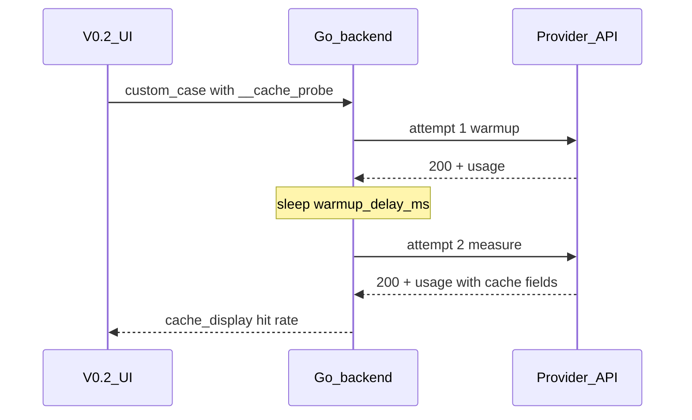

# Cache Hit Rate Probe Methodology

This document describes how **测评工具 V0.2 → 缓存命中率** measures prompt-cache effectiveness across channels for the same evaluation model.

## Goal

Compare whether identical cache-oriented requests hit provider-side prompt caches on the **second** identical call, and report `cached_tokens` / `prompt_cache_hit_tokens` and a derived hit rate per channel.

## Where It Lives

| Layer | Location |
|---|---|
| UI group | V0.2 Step 4 tab **缓存命中率** |
| Synthetic cases | `cacheCasesForRunV02()` in `web/main.js` (not in provider manifests) |
| Runner | `__cache_probe` handling in `backend/main.go` |

## Request Flow

Each selected cache case runs **two identical non-stream requests**:

1. **Warmup** — populate provider cache; only requires HTTP 200.
2. **Measure** — same payload after a short delay (default 400ms); read cache usage fields.



## Case Kinds

### Observational cases

| case_id | kind | Protocols | Default selected |
|---|---|---|---|
| `cache_passive_long_prompt` | `passive` | chat_completions, anthropic_messages | yes |
| `cache_prompt_cache_key` | `prompt_cache_key` | chat_completions | yes |
| `cache_control_ephemeral` | `cache_control` | chat_completions, anthropic_messages | no (optional) |

### Threshold assertion cases (≥ 85%)

Same request shapes as above, with `__cache_probe.min_hit_rate: 0.85`. Default **not** selected.

| case_id | kind | Protocols |
|---|---|---|
| `cache_passive_hit_rate_85` | `passive` | chat_completions, anthropic_messages |
| `cache_prompt_cache_key_hit_rate_85` | `prompt_cache_key` | chat_completions |
| `cache_control_ephemeral_hit_rate_85` | `cache_control` | chat_completions, anthropic_messages |

### passive

Long fixed system/context prefix (repeated filler above passive-cache thresholds) plus a short user turn. No explicit cache parameters.

### prompt_cache_key

Same long prefix with a stable `prompt_cache_key: "provider-diff-cache-probe"`.

### cache_control

Explicit `cache_control: { type: "ephemeral" }` on the cacheable content block:

- **chat_completions** — `messages[].content[]` array block
- **anthropic_messages** — `system[]` array block

## Hit Rate Calculation

From the **measure** attempt `usage`:

```
hit  = usage.prompt_tokens_details.cached_tokens
    ?? usage.prompt_cache_hit_tokens
    ?? 0

denom = hit + prompt_cache_miss_tokens   (when miss field present)
     ?? usage.prompt_tokens (or input_tokens)

hit_rate = hit / denom
```

## Conclusion Policy (observational + warning)

Applies when `min_hit_rate` is omitted or zero.

| Situation | support_conclusion | UI |
|---|---|---|
| Warmup or measure not HTTP 200 | `request_failed` | fail |
| Measure HTTP 200, hit_tokens > 0 | `supported` | pass |
| Measure HTTP 200, cache fields present, hit_tokens = 0 | `ignored` | warning (not fail) |
| Measure HTTP 200, no cache usage fields | `ignored` | warning (not fail) |

V0.2 treats cache `ignored` rows as **warning-colored** while still counting them as operationally acceptable (assertion `cache_hit_rate` passes).

## Conclusion Policy (threshold assertion)

When `__cache_probe.min_hit_rate` is set (currently `0.85` in V0.2 threshold cases):

| Situation | support_conclusion | UI |
|---|---|---|
| Warmup or measure not HTTP 200 | `request_failed` | fail |
| Measure HTTP 200, hit_rate ≥ min_hit_rate | `supported` | pass |
| Measure HTTP 200, hit_rate < min_hit_rate | `schema_mismatch` | fail |
| Measure HTTP 200, no cache usage fields | `schema_mismatch` | fail |

`cache_display` also includes `命中率阈值: "85.0%"` for threshold cases.

## Response Shape

The runner stores a synthetic JSON body on the case result:

```json
{
  "cache_probe": { "kind": "passive", "attempts": [ ... ] },
  "cache_display": {
    "缓存命中 tokens": "128",
    "缓存命中率": "85.3%",
    "命中字段": "usage.prompt_tokens_details.cached_tokens",
    "命中率阈值": "85.0%"
  }
}
```

## Related Docs

- [docs/api/usage.md](../api/usage.md) — per-provider cache usage field matrix
- [docs/project/capacity-probe-methodology.md](./capacity-probe-methodology.md) — similar `__*` probe pattern
