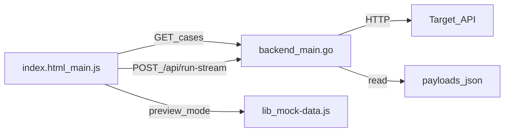

# Noctua 兼容测试 PRD

## 0. 文档元信息

| 字段 | 内容 |
|------|------|
| 产品名 | **Noctua**（对外）/ `provider-diff`（仓库、Docker、后端二进制） |
| 文档版本 | v2.0 |
| 适用范围 | **接口参数评测**主流程：运行页 UI、Go 后端、payloads 用例库、断言与结果模型 |
| 状态 | 已实现（持续演进） |
| 历史文档 | 附录 A 保留 v0「llm-rosetta」mock 原型需求 |

### 相关文档索引

| 主题 | 路径 |
|------|------|
| 项目说明与快速开始 | [README.md](README.md) |
| 视觉与设计系统 | [design-system/design-system.md](design-system/design-system.md) |
| 各渠道参数与 case 来源 | [docs/api/openai.md](docs/api/openai.md)、[docs/api/deepseek.md](docs/api/deepseek.md)、[docs/api/ali-chat.md](docs/api/ali-chat.md)、[docs/api/minimax-chat.md](docs/api/minimax-chat.md)、[docs/api/siliconflow-chat.md](docs/api/siliconflow-chat.md)、[docs/api/claude.md](docs/api/claude.md)、[docs/api/openrouter-chat.md](docs/api/openrouter-chat.md)、[docs/api/vllm.md](docs/api/vllm.md) |
| `usage` 字段断言矩阵 | [docs/api/usage.md](docs/api/usage.md) |
| 容量探测方法论 | [docs/project/capacity-probe-methodology.md](docs/project/capacity-probe-methodology.md) |
| 性能测试（范围外） | [docs/project/performance-benchmark-design.md](docs/project/performance-benchmark-design.md) |

### 命名约定

| 场景 | 名称 |
|------|------|
| 产品、Web UI、macOS App、导出报告 | **Noctua** |
| Git 仓库、npm、Docker 镜像/Compose 服务 | `provider-diff` |
| 嵌入式后端进程 | `provider-diff-backend` |
| macOS Bundle ID | `cn.siliconflow.noctua` |

---

## 1. 产品概述

Noctua 是一款 **LLM 网关协议兼容性与策略测试工具**。用户配置目标渠道的 API Key、Base URL、Model，从结构化用例库中选择测试集，由后端发起真实 HTTP 请求，输出每个 case 的：

- 参数/请求是否被供应商 **支持、拒绝、静默接受但未证明生效**
- 响应是否满足 **断言**（HTTP 状态、必填字段、usage、thinking 证据等）
- 与 **baseline** 响应的 **JSON 结构差异**（字段存在性与类型，不比具体值）
- 面向网关的 **处置建议**（放行、过滤、适配等）

一句话定位：对 **OpenAI-compatible Chat Completions** 及 **Anthropic Messages** 端点做可复现、可导出的结构化兼容性探测。

---

## 2. 用户场景与成功标准

### 核心用户

- 网关 / 中转平台工程师：评估新渠道能否透传某类 OpenAI 参数
- 渠道接入与 QA：回归验证参数支持与响应结构
- 售前 / 技术支持：生成可导出的兼容性结论与客户话术

### 典型场景

1. **新渠道接入**：选 DeepSeek + Chat Completions，跑默认 case 集，查看拒绝项与结构 diff
2. **网关策略验证**：对比同一模型在官方 Base URL 与自有网关 URL 下的差异（Batch 模式）
3. **推理开关探测**：使用 Thinking Probe 渠道，分析 thinking 参数与 `reasoning_content` 落点
4. **容量边界**：勾选 Max Output / Total Context case，确认 endpoint 接受的最大档位
5. **与历史基线对比**：从 baseline 下拉选择已保存的 OEM 报告，对比当前跑批结果

### 成功标准

给定渠道 + endpoint + 用例集 + 有效 API Key 后：

- 运行过程通过 SSE 实时展示进度，可中断
- 每个 case 产出明确的 `support_conclusion`、断言明细、结构 diff
- 支持 Export JSON / Markdown
- 运行记录写入浏览器 `localStorage`（供 Baseline 选择与报告页消费，报告页 spec 见第 10 节）

---

## 3. 系统架构

### 3.1 技术栈

| 层 | 实现 |
|----|------|
| 前端 | 静态 HTML（[index.html](index.html)）+ 原生 JS（[main.js](main.js)） |
| 设计系统 | [design-system/](design-system/)（light-first，支持 `data-theme="dark"`） |
| 后端 | Go（[backend/main.go](backend/main.go)） |
| 用例库 | `payloads/{provider}/*.json` + `manifest.json` |
| 渠道模板 / 预览数据 | [lib/mock-data.js](lib/mock-data.js)、[lib/providerx-rules.js](lib/providerx-rules.js) |

本地开发：`npm run dev` → 静态服务 `:4173` + Go API `:8080`。

### 3.2 数据流



### 3.3 实现锚点

| 职责 | 路径 |
|------|------|
| 运行页 DOM 与导航 | [index.html](index.html) `#runView` |
| 运行逻辑、diff、导出 | [main.js](main.js) |
| 渠道卡片、Endpoint 模板 | `lib/mock-data.js` → `CHANNEL_TEMPLATES`、`ENDPOINT_TEMPLATES` |
| 参数来源标签、结论枚举 | `lib/providerx-rules.js` |
| API 与断言引擎 | `backend/main.go` |
| 用例定义 | `payloads/` |

### 3.4 运行模式

| 模式 | 条件 | 行为 |
|------|------|------|
| 真实测试 | 当前 channel + endpoint 有 runnable `provider_id`，后端可用 | 调用 `/api/run-stream` 等，发真实 HTTP |
| 预览模式 | channel 无 backend provider 或用户未配置 Key | 前端 mock 定时器模拟进度与结果 |
| 不支持 | 当前 endpoint 对该 channel 标记 `supported: false` | 禁用运行，展示 `unavailable_reason` |

---

## 4. 运行页 UI 需求

运行页为顶部导航 **「接口参数评测」**（`#runView`）。自上而下分为以下区块。

### 4.1 页头

- 标题：「Noctua 真实请求测试」
- 说明文案：配置 API Key、Base URL、Model，选择用例后运行
- 主 CTA：**运行测试**（`#runTests`）

### 4.2 Endpoint 切换

两个 tab（`ENDPOINT_TEMPLATES`）：

| endpoint_id | 标签 | 说明 |
|-------------|------|------|
| `chat_completions` | Chat Completions | OpenAI-compatible `/chat/completions` |
| `anthropic_messages` | Anthropic Messages | Anthropic-compatible `/v1/messages` |

切换后重新加载对应用例列表；不支持的 channel 在该 endpoint 下禁用运行。

### 4.3 渠道模板卡片

11 张 channel 卡片（`#channelCards`），选中态高亮。每张展示：logo、名称、描述、参数规模摘要。

| channel_id | 显示名 | provider_id（Chat） | 默认 Base URL | 默认 Model |
|------------|--------|---------------------|---------------|------------|
| `openai` | OpenAI Official | `openai` | `https://api.openai.com/v1` | `gpt-4o-mini` |
| `claude` | Claude Official | `claude` | `https://api.anthropic.com/v1` | `claude-sonnet-4-6` |
| `deepseek` | DeepSeek | `deepseek` | `https://api.deepseek.com` | `deepseek-v4-flash` |
| `aliyun` | Aliyun Bailian | `ali` | `https://dashscope.aliyuncs.com/compatible-mode/v1` | `qwen-plus` |
| `openrouter` | OpenRouter | `openrouter` | `https://openrouter.ai/api/v1` | `openai/gpt-4o-mini` |
| `minimax` | MiniMax | `minimax` | `https://api.minimaxi.com/v1` | `MiniMax-M2.7` |
| `vllm` | vLLM | `vllm` | `http://localhost:8000/v1` | `Qwen/Qwen3-8B` |
| `siliconflow` | SiliconFlow | `siliconflow` | `https://api.siliconflow.cn/v1` | `Pro/zai-org/GLM-4.7` |
| `thinking` | Thinking Probe | `thinking` | `https://api.openai.com/v1` | `gpt-5.1` |
| `silinex_overseas` | 海外站 | `siliconflow` | `https://sr-endpoint.horay.ai` | `Pro/zai-org/GLM-4.7` |
| `silinex_china` | 国内站 | `siliconflow` | `https://api.sr.silinex.work` | `Pro/zai-org/GLM-4.7` |

**Base URL 预设**（多区域/多站点）：Aliyun（华北 2 / 弗吉尼亚 / 新加坡）、MiniMax（国内 / 海外）、SiliconFlow（cn / com）等，通过下拉选择后写入输入框。

**参数 chip**：来自 channel 模板的 `parameters` 分组；每个 chip 旁标注参数来源（`openai-standard`、`qwen-extension` 等，定义于 `providerx-rules.js`）。完整可执行 case 列表来自后端 API，不在 UI 硬编码枚举。

### 4.4 连接配置

| 字段 | 要求 |
|------|------|
| API Key | `type=password`，显示/隐藏切换，placeholder `sk-...` |
| Base URL | 预设下拉 + 可编辑文本，等宽字体 |
| Model | 文本输入，随 channel/endpoint 切换填入默认值 |

### 4.5 运行选项

| 字段 | 要求 |
|------|------|
| Concurrency | 数字输入，1–8，默认 3 |
| baseline | 下拉选择历史报告中带 baseline 响应的记录；支持 pinned OEM 基线 |
| Batch | 开关；开启后 2–3 个 target 行（Base URL / API Key / Model 可覆盖主配置） |
| 粘贴导入 | `base_url \| api_key \| model` 文本批量导入 target |

### 4.6 高级配置：HTTP 代理

折叠面板「请求代理设置」：

- 启用代理 toggle
- Proxy URL 输入（如 `http://127.0.0.1:7890`）
- 摘要文案：直连 / 代理

### 4.7 测试套件与用例选择

**测试套件**（`#testSuite`，默认折叠）：展示当前 channel 的重点参数 chip 分组。

**用例选择器**（`#caseSelector`）：

- 从 `GET /api/providers/{provider}/cases` 加载
- 默认勾选「常规」case；扩展、VLM、容量 case 按需开启
- 分组展示：
  - 概览 / 可选扩展
  - VLM（多模态）
  - 容量（Max Output / Total Context）
  - 自定义 payload
  - 单参数用例
  - 参数组合用例
  - 基础协议与场景用例
- 操作：全选、清空、单 case 勾选

**自定义 payload**：粘贴 JSON object，添加为临时 case 一并提交。

### 4.8 执行进度（`#progressPanel`）

- 进度条 + `已完成 / 总数` + 当前 case 名
- 滚动日志（monospace）：每行 case 结论与耗时
- **停止**按钮：中断 SSE / 取消进行中的请求

### 4.9 结果矩阵（`#resultsPanel`）

**统计卡片**（4 项）：

| 卡片 | 含义 |
|------|------|
| 符合预期 | 实际结论与 case `expect` 一致，且无失败断言 |
| 接受未证明 / 权限 | `ignored` 或 `permission_limited` |
| 预期外 | `rejected_400`、`request_failed`、`schema_mismatch` 等与预期不符 |
| 结构差异 | 与 baseline 存在 missing/extra/type diff |

**结果表列**：Case / 参数、分类、支持性、预期、证据、HTTP 状态、结构差异。

**筛选 Tab**：全部、失败、警告、结构差异。

**操作**：导出 JSON、导出 Markdown、重新运行。

**容量摘要**（`#capacitySummary`）：当本次运行包含容量 case 时，展示 Max Output / Total Context 结论块。

### 4.10 Case 详情（行展开）

展开行后展示：

1. **Request**：body、headers、代理信息；被测参数高亮
2. **断言结果**：每条 assertion 的 pass/fail 与 message
3. **Response 对比**：baseline（左）vs 当前渠道（右），含 status / latency
4. **结构 diff**：见第 7.2 节
5. **Severity** 徽章：CRITICAL / EXTENSION / COMPATIBLE
6. **Gateway action** 与证据等级
7. **操作**：复制 diff、复制结论、保存为 case（toast）

### 4.11 全局 UI

- **主题切换**：header 中 Light / Dark（`data-theme`，持久化 `localStorage`）
- **账户模式标识**：真实测试 / 预览模式
- **响应式**：基础 Web 响应式（设计系统 v2 支持 Web + Desktop）

### 4.12 与历史的边界

运行完成后自动写入 `localStorage`（`noctua-history-v1`，最多 120 条）。Baseline 下拉与 pinned 基线消费该历史。**报告中心的聚合、筛选、导入** 不在本 PRD 范围，见第 10 节。

---

## 5. 后端 API 需求

Base URL 默认 `http://127.0.0.1:8080`。兼容测试相关端点如下。

### 5.1 健康与目录

| 方法 | 路径 | 说明 |
|------|------|------|
| `GET` | `/healthz` | 健康检查 |
| `GET` | `/api/providers` | 返回 payloads 下 provider 目录列表 |
| `GET` | `/api/providers/{provider}/cases?endpoint_id=` | 用例目录、分组、参数列表 |
| `GET` | `/api/providers/{provider}/cases/{caseId}/payload` | 完整 case JSON |

`ProviderCasesResponse` 包含：`cases`、`cases_by_parameter`、`cases_by_category`、`parameters`、`categories`、`common_expect`、`default_model` 等。

### 5.2 执行

| 方法 | 路径 | 说明 |
|------|------|------|
| `POST` | `/api/run` | 阻塞执行，返回完整 `RunResponse` |
| `POST` | `/api/run-stream` | **主路径**：NDJSON/SSE 流式逐 case 返回 |
| `POST` | `/api/run-batch` | 多 target 批量（最多 32 个 target） |
| `POST` | `/api/run-batch-stream` | 批量 + 流式 |

### 5.3 请求体（`RunRequest`）

```json
{
  "provider": "deepseek",
  "endpoint_id": "chat_completions",
  "case_ids": ["deepseek_sampling_temperature"],
  "custom_cases": [],
  "api_key": "sk-...",
  "base_url": "https://api.deepseek.com",
  "model": "deepseek-v4-flash",
  "proxy": { "enabled": false, "url": "", "mode": "direct" },
  "max_concurrency": 3
}
```

| 字段 | 说明 |
|------|------|
| `provider` | payloads 目录名，如 `deepseek`、`ali_messages` |
| `endpoint_id` | `chat_completions` 或 `anthropic_messages` |
| `case_ids` | 要执行的 case_id 列表 |
| `custom_cases` | 前端构造的临时 `TestCase` |
| `api_key` | 供应商 API Key（仅内存传输，不落盘） |
| `base_url` | 覆盖 manifest 默认 Base URL |
| `model` | 覆盖 case payload 中的 model |
| `proxy` | HTTP 代理配置 |
| `max_concurrency` | case 级并发，默认上限 20（后端），UI 限制 1–8 |

`BatchRunRequest` 额外包含 `targets[]`（每项为完整 `RunRequest` 子集）及共享的 `case_ids`、`custom_cases`、`proxy`、`max_concurrency`。

### 5.4 响应（`RunCaseResult`）

每个 case 结果核心字段：

| 字段 | 说明 |
|------|------|
| `case_id`, `title`, `category`, `parameters` | 用例元数据 |
| `method`, `url` | 实际请求 |
| `request_body`, `request_headers` | 发送内容 |
| `http_status`, `latency_ms` | 响应状态与耗时 |
| `response_body`, `raw_response`, `response_headers` | 响应内容 |
| `support_conclusion` | 支持性结论（见 7.1） |
| `expected_http_status`, `expected_support_conclusion` | 来自 case `expect` |
| `assertions` | 断言列表 `{ name, pass, message }` |
| `error` | 请求级错误信息 |

容量 case 额外在聚合层附带 `capacity_display`（Max Output / Total Context 中文展示结论）。

### 5.5 流式事件（`/api/run-stream`）

Content-Type: `application/x-ndjson`。每行一个 JSON 事件：

| type | 说明 | 主要字段 |
|------|------|----------|
| `start` | 批次开始 | `total`, `provider`, `base_url`, `endpoint_url`, `model`, `started_at` |
| `result` | 单 case 完成 | `index`, `total`, `result`（`RunCaseResult`） |
| `end` | 批次结束 | `total`, `finished_at` |

批量流式额外事件：`target_start`、`target_end`、`target_error`（含 `target_index`、`target_label`、`target_total`）。

客户端断开时，进行中 case 标记为取消（HTTP 499 / `request_failed`）。

### 5.6 运行时能力

- 根据 manifest 拼接 endpoint URL（避免重复 path）
- 支持 case 级 `base_url` 覆盖
- 支持 Chat Completions 与 Anthropic Messages 两种请求形态
- 识别 payload 中 `__capacity_probe` 标记，展开为多档位探测
- CORS：允许本地 UI 源（`:4173`）

---

## 6. 测试用例（payloads）模型

### 6.1 目录结构

```
payloads/
  {provider}/
    manifest.json      # 索引与公共 expect
    {nnn}_{category}_{name}.json
```

共 **15 个 provider 目录**，约 **463** 个 case 文件：

| provider | Endpoint 类型 | case 数 | 参数文档 |
|----------|---------------|---------|----------|
| `openai` | Chat Completions | 53 | [docs/api/openai.md](docs/api/openai.md) |
| `claude` | Chat Completions | 35 | [docs/api/claude.md](docs/api/claude.md) |
| `claude_messages` | Anthropic Messages | 5 | [docs/api/claude.md](docs/api/claude.md) |
| `deepseek` | Chat Completions | 60 | [docs/api/deepseek.md](docs/api/deepseek.md) |
| `deepseek_messages` | Anthropic Messages | 10 | [docs/api/deepseek-message.md](docs/api/deepseek-message.md) |
| `ali` | Chat Completions | 54 | [docs/api/ali-chat.md](docs/api/ali-chat.md) |
| `ali_messages` | Anthropic Messages | 10 | [docs/api/ali-message.md](docs/api/ali-message.md) |
| `minimax` | Chat Completions | 38 | [docs/api/minimax-chat.md](docs/api/minimax-chat.md) |
| `minimax_messages` | Anthropic Messages | 10 | [docs/api/minimax-message.md](docs/api/minimax-message.md) |
| `openrouter` | Chat Completions | 77 | [docs/api/openrouter-chat.md](docs/api/openrouter-chat.md) |
| `openrouter_messages` | Anthropic Messages | 10 | [docs/api/openrouter-message.md](docs/api/openrouter-message.md) |
| `siliconflow` | Chat Completions | 42 | [docs/api/siliconflow-chat.md](docs/api/siliconflow-chat.md) |
| `siliconflow_messages` | Anthropic Messages | 10 | [docs/api/siliconflow-message.md](docs/api/siliconflow-message.md) |
| `vllm` | 自托管 OpenAI-compat | 30 | [docs/api/vllm.md](docs/api/vllm.md) |
| `thinking` | 跨渠道推理探针 | 19 | （专用 reasoning 参数集） |

Channel 卡片通过 `provider_id` 映射到上表；Messages endpoint 使用 `*_messages` provider。

### 6.2 manifest.json

```json
{
  "provider": "openai",
  "base_url": "https://api.openai.com/v1",
  "endpoint": "/chat/completions",
  "method": "POST",
  "source": "../../docs/api/openai.md",
  "default_model": "gpt-4o-mini",
  "reasoning_model": "gpt-5.1",
  "vision_model": "gpt-4o-mini",
  "common_expect": { "http_status": 200, "support_conclusion": "supported", "...": "..." },
  "cases": ["001_basic_minimal.json", "..."]
}
```

### 6.3 case JSON 示例

```json
{
  "case_id": "deepseek_sampling_temperature",
  "title": "temperature 采样",
  "category": "sampling",
  "parameters": ["temperature"],
  "method": "POST",
  "path": "/chat/completions",
  "payload": {
    "model": "deepseek-v4-flash",
    "messages": [{ "role": "user", "content": "..." }],
    "temperature": 0.7
  },
  "expect": {
    "http_status": 200,
    "support_conclusion": "supported",
    "required_response_fields": ["id", "object", "created", "model", "choices", "usage"]
  }
}
```

### 6.4 case 字段说明

| 字段 | 必填 | 说明 |
|------|------|------|
| `case_id` | 是 | 全局唯一标识 |
| `title` | 是 | UI 展示标题 |
| `category` | 是 | 分类：sampling / length / reasoning / tools / stream / basic / … |
| `parameters` | 是 | 关联参数名列表 |
| `method`, `path` | 是 | HTTP 方法与路径 |
| `payload` | 是 | 请求体；可含 `__capacity_probe` |
| `headers` | 否 | 额外请求头（如 DashScope `X-DashScope-DataInspection`） |
| `expect` | 是 | 断言与预期结论 |
| `optional` | 否 | 可选 case，默认不勾选 |
| `requires_model_capability` | 否 | 需要 reasoning / vision 等模型能力 |

### 6.5 用例分类（UI 分组）

| 分组 | 说明 |
|------|------|
| 常规 / 单参数 | 每个 case 验证一个或少量参数 |
| 参数组合 | 多参数同时提交 |
| 场景 | model、messages、多轮、工具链、响应头等 |
| 可选扩展 | `optional: true` 或扩展能力相关 |
| VLM | 含 `image_url` 等多模态 |
| 容量 | Max Output / Total Context 边界档位 |
| 自定义 | 用户粘贴的临时 payload |

### 6.6 维护原则

1. 参数语义与供应商文档以 `docs/{provider}.md` 为准
2. `manifest.json` 是用例索引；新增 case 必须带 `expect`
3. `common_expect` 提供 provider 级默认断言，case 可覆盖
4. 不在 PRD 正文维护逐参数列表——以 manifest API 返回为准

---

## 7. 断言引擎与结果模型

### 7.1 支持性结论（`support_conclusion`）

后端根据 HTTP 状态、错误、断言与 `expect` 推导：

| 值 | UI 标签 | 含义 |
|----|---------|------|
| `supported` | 支持 | 请求成功且语义断言通过 |
| `ignored` | 接受未证明生效 | 2xx 但参数可能被忽略，或可选能力不可用 |
| `rejected_400` | 拒绝 | 供应商明确拒绝（通常 400） |
| `request_failed` | 请求失败 | 网络、Key、超时等 |
| `permission_limited` | 权限受限 | 403 等，不能据此判参数不支持 |
| `schema_mismatch` | 断言失败 | 2xx 但响应结构/语义断言未通过 |
| `unknown` | 未覆盖 | 无足够证据 |

推导规则要点：

- `expect.support_conclusion` 优先作为预期
- HTTP ≥ 400 时映射为 `rejected_400` 或 `request_failed`
- `supported` + 非 `http_status` 断言失败 → `schema_mismatch`
- 可选能力 case 遇模型不支持错误 → `ignored`（`optional_capability_mismatch`）

### 7.2 结构 diff 算法

前端 `compareStructure(baseline, channel)`（[main.js](main.js)）：

- **只比较 JSON 结构**（字段路径 + 类型），**不比较具体值**
- 递归遍历 object；array 取首个元素推断 `[]` 子路径类型

| diff.kind | 前缀 | 含义 |
|-----------|------|------|
| `missing` | `-` | baseline 有、channel 无 |
| `extra` | `+` | channel 有、baseline 无（非标扩展） |
| `type` | `~` | 同路径类型不一致 |

### 7.3 Severity

| 级别 | 条件 |
|------|------|
| **CRITICAL** | 缺失 baseline 必填字段（`id` / `object` / `choices` / `usage` / `model`） |
| **EXTENSION** | 存在 extra 或 type diff，但无 critical 缺失 |
| **COMPATIBLE** | 无 diff |

### 7.4 断言类型（`evaluateAssertions`）

| 断言名 | 说明 |
|--------|------|
| `http_status` | HTTP 状态码 |
| `required_response_fields` | 顶层响应必填字段 |
| `choice_required_fields` | `choices[]` 内字段 |
| `usage_required_fields` | `usage` 内字段（含嵌套，见 [docs/api/usage.md](docs/api/usage.md)） |
| `messages_required_response_fields` | Anthropic Messages 形态 |
| `content_required_fields` | Messages content block |
| `response_mode` / `required_chunk_fields` | SSE 流式帧 |
| `sse_usage_required_fields` | 流式 usage chunk |
| `content_should_parse_as_json` | `json_object` 响应 |
| `assistant_content_non_empty` | assistant 内容非空 |
| `assistant_content_starts_with` | 内容前缀 |
| `thinking_required` / `thinking_absent` | 推理内容开关 |
| `thinking_evidence_required` | `reasoning_content` 或 reasoning tokens 证据 |
| `thinking_location_probe` | 推理内容落点探测 |
| `optional_capability_mismatch` | 可选能力不可用 → ignored |
| `n_supported` / `token_limit` 等 | 推断类断言（`inferredAssertions`） |

### 7.5 证据等级（`evidence_level`）

| 值 | 说明 |
|----|------|
| `asserted` | 有响应且断言通过 |
| `observed` | 有响应，断言较弱 |
| `inferred` | 基于预期或预览数据 |
| `none` | 无有效响应 |

### 7.6 网关处置建议（`gateway_action`）

| 值 | 说明 |
|----|------|
| `pass_through` | 可低风险透传 |
| `strip_or_warn` | 提示或过滤（如 `ignored`） |
| `strip_or_transform` | 过滤或转换（如 `rejected_400`） |
| `adapter_required` | 需 provider adapter（如 `schema_mismatch`） |
| `retry_or_review` | 先排查 Key/URL/代理/权限 |
| `manual_review` | 证据不足，需补充 case |

### 7.7 UI 预期匹配

结果行额外展示 **预期** 列：比较 `support_conclusion` 与 case `expect.support_conclusion` 是否一致，用于「符合预期 / 预期外」统计。

---

## 8. 渠道与 Provider 映射说明

### 8.1 Endpoint 与 provider 后缀

- `chat_completions` → provider 目录名无后缀（如 `deepseek`）
- `anthropic_messages` → provider 目录名带 `_messages`（如 `deepseek_messages`）

`lib/mock-data.js` 的 `withEndpoints()` 为每个 channel 配置两种 endpoint；不支持时 `anthropic_messages.supported = false`。

### 8.2 特殊渠道说明

| 渠道 | 说明 |
|------|------|
| **Thinking Probe** | 跨供应商推理开关探针；跑完后 UI 可展示 thinking 开/关族分析 |
| **vLLM** | 自托管 OpenAI-compatible；含 chat template、structured outputs、token IDs 等扩展 |
| **OpenRouter** | 含路由（`provider.order`）、插件、web_search 等聚合能力 case |
| **Silinex 海外/国内** | 自有 endpoint，payload 暂复用 `siliconflow` provider |
| **Aliyun** | 含 DashScope 私有字段、搜索、skills、请求头 case |

### 8.3 Baseline 来源

| 来源 | 说明 |
|------|------|
| 历史报告 | 用户选择已保存 run 作为 baseline 响应来源 |
| Pinned OEM | `PINNED_BASELINE_IDS` 为部分 provider+endpoint 预置原厂基线 report id |
| 启动导入 | `outputs/original-baselines.import.json` 自动导入历史 |

结构 diff 的 baseline 标签随所选 baseline 变化（不限于 OpenAI）。

---

## 9. 容量探测（兼容测试子能力）

### 9.1 目标

探测两类容量指标：

- **Max Output**：endpoint 接受的最大输出预算档位
- **Total Context**：endpoint 接受的最大上下文预算档位

### 9.2 实现方式

1. **运行页**：勾选容量 case；payload 含 `__capacity_probe` 标记，后端按 K/M 档位展开（大→小），详见 [docs/project/capacity-probe-methodology.md](docs/project/capacity-probe-methodology.md)
2. **CLI**：`node scripts/probe-capacity.js` → `outputs/capacity-probes/*.json`（运维/批量探测，非 UI 必测）

### 9.3 规则摘要

- K/M 标签按 1024 进制：`128k = 131072`，`1m = 1048576`
- Total Context 探测使用 **5% safety margin**（默认测档位的 95%）
- 默认在「更高一档不支持 + 当前档支持」时停止；`--exhaustive` 可跑完全部档位
- 运行后 UI `capacity_summary` 展示 `capacity_display.最大Max Output`、`capacity_display.最大Total Context` 等

### 9.4 注意

- Max Output 验证的是 **请求被接受**，不代表模型实际生成了该 token 数
- 结论以 `usage` 中实际 token 数为辅助证据

---

## 10. 非目标与范围外模块

以下能力 **不在本 PRD 范围**，仅提供索引：

| 模块 | 说明 | 参考 |
|------|------|------|
| 报告中心 | 历史聚合、筛选、导入 JSON、推送飞书 | `main.js` reports view |
| 性能测试 | vLLM `benchmark_serving`、TTFT/吞吐 | [docs/project/performance-benchmark-design.md](docs/project/performance-benchmark-design.md) |
| 飞书文档写入 | `POST /api/feishu/document` | backend + Feishu 集成页 |
| EvalScope / OpenCompass | iframe 嵌入外部评测面板 | [README.md](README.md) Docker Compose |
| macOS DMG 桌面端 | Electron 打包 | [README.md](README.md) |
| 用户认证 / 多租户 | 明确不做 | — |
| 云端同步历史 | 历史仅 `localStorage` | — |

### 与 v0 原型的差异

v0 明确「不做」的能力，当前产品 **已实现**：

- 真实 HTTP 请求（Go 后端）
- 浏览器 localStorage 历史（最多 120 条）
- 主题切换（light / dark）
- 基础响应式 Web 布局

---

## 11. 交付与验收标准

### 11.1 本地验收步骤

```text
npm run dev
→ 浏览器打开运行页（默认 http://127.0.0.1:4173）
→ 选择 DeepSeek + Chat Completions
→ 填写有效 API Key，保留默认 Base URL / Model
→ 勾选 3–5 个常规 case，点击「运行测试」
→ 确认：SSE 进度、结果矩阵、展开详情、结构 diff、Export Markdown 均正常
→ 切换 Anthropic Messages endpoint，确认用例列表切换为 deepseek_messages
→ 开启 Batch，配置 2 个 target，确认并行出结果
→ 勾选容量 case，确认跑完后出现 Max Output / Total Context 摘要
```

### 11.2 实现检查清单

- [ ] 11 个 channel 卡片可切换，默认值正确填入
- [ ] 后端不可用时展示明确错误，预览 channel 可演示 mock
- [ ] case 选择器分组、全选/清空、自定义 payload 可用
- [ ] 代理配置传入后端并生效
- [ ] 7 类 `support_conclusion` 在 UI 有对应徽章与筛选
- [ ] 结构 diff 与 CRITICAL / EXTENSION / COMPATIBLE 一致
- [ ] 运行结果写入 localStorage，baseline 下拉可选
- [ ] 导出 JSON / Markdown 包含完整 case 明细

### 11.3 单一事实来源

| 内容 | 维护位置 |
|------|----------|
| 渠道 UI 模板 | `lib/mock-data.js` |
| 结论/网关枚举 | `lib/providerx-rules.js` |
| 用例数量与索引 | `payloads/*/manifest.json` |
| API 契约与断言 | `backend/main.go` |
| 容量方法论 | `docs/project/capacity-probe-methodology.md` |
| 视觉规范 | `design-system/design-system.md` |

---

## 附录 A：v0 原型需求（llm-rosetta，mock 前端）

> 以下内容為 2024 年 v0 原型阶段的原始需求提示词，描述的是 **llm-rosetta** mock 前端（Next.js + 假数据、不发真实请求）。**已被正文 Noctua 兼容测试 PRD 取代**，仅作历史参考。实现上与当前产品存在显著差异（技术栈、渠道数量、真实后端、结果模型等）。

我要做一个 LLM 网关合规性测试工具的前端界面，叫 "llm-rosetta"。功能是：用户填入一个 LLM 渠道的 API 信息，选择一套测试模板，前端会发起一组测试请求，检测这家渠道对 OpenAI 协议的兼容程度（哪些参数支持、响应里多了哪些非标字段）。

## 整体风格

**核心参考 OpenRouter (openrouter.ai) 的风格**：
- 深色主题为主（背景 #0a0a0a / #111111）
- 字体偏技术感，等宽字体用于代码和 JSON
- 紧凑、信息密度高、不浮夸
- 主色调：中性灰 + cyan/teal 作为强调色 (#06b6d4)
- 状态颜色：绿 (#10b981 通过) / 黄 (#f59e0b 警告) / 红 (#ef4444 不合规) / 灰 (#6b7280 不适用)
- 圆角小 (rounded-md 不要 rounded-2xl)
- 大量使用 monospace 字体

使用 Next.js 14 (App Router) + Tailwind CSS + shadcn/ui。所有数据用 mock，不要真的调 LLM API。

## 页面布局：单页应用，分四个区域，垂直排列

### 区域 1：渠道选择 + 配置输入区（顶部）

**第一步：选择一个渠道模板**

顶部 5 张卡片横排，每张卡片是一个预设渠道，点击切换。卡片显示：渠道 logo（用 emoji 代替即可：🇺🇸🐳☁️🎬🧊）、渠道名、参数数量。

| 卡片 | 渠道名 | 描述 |
|---|---|---|
| 🇺🇸 OpenAI Official | 参考基线 | 25 parameters · the standard |
| 🐳 DeepSeek | DeepSeek 官方 | 18 parameters |
| ☁️ Aliyun Bailian | 阿里百炼（DashScope） | 21 parameters |
| 🎬 MiniMax | MiniMax 官方 | 15 parameters |
| 🧊 SiliconFlow | 硅基流动 | 20 parameters |

选中的卡片用 cyan 边框高亮。点击后下方表单自动填入对应的 Base URL 占位符和 Model 占位符。

**第二步：填入 API 信息**

下方表单，双列布局：

- **API Key**: 密码输入框（type=password），带显示/隐藏切换，placeholder "sk-..."
- **Base URL**: 文本输入，等宽字体，根据上面选中的卡片自动填默认值（可改）
- **Model**: 文本输入，等宽字体，每个渠道有一个推荐默认值

各渠道的默认值（hardcode 在 mock 里）：

| 渠道 | Base URL | 推荐 Model |
|---|---|---|
| OpenAI | https://api.openai.com/v1 | gpt-4o-mini |
| DeepSeek | https://api.deepseek.com/v1 | deepseek-chat |
| Aliyun Bailian | https://dashscope.aliyuncs.com/compatible-mode/v1 | qwen-max |
| MiniMax | https://api.minimaxi.com/v1 | MiniMax-M2 |
| SiliconFlow | https://api.siliconflow.cn/v1 | deepseek-ai/DeepSeek-V3 |

**第三步：展示该模板的测试参数清单**

下方一个折叠面板，标题 "Test Suite: <selected channel> (<n> parameters)"，默认折叠。展开后显示该模板包含的参数清单，按分组：

每个渠道的参数清单（hardcode 在 mock 里）：

**OpenAI Official（25 个，全集）**
- Sampling: temperature, top_p, n, seed, stop, frequency_penalty, presence_penalty, logit_bias
- Length: max_tokens, max_completion_tokens
- Reasoning: reasoning_effort
- Output: response_format
- Tools: tools, tool_choice, parallel_tool_calls
- Protocol: stream, stream_options
- Debug: logprobs, top_logprobs
- Metadata: user, metadata, store
- （额外）service_tier, prediction, audio

**DeepSeek（18 个）**
- Sampling: temperature, top_p, seed, stop, frequency_penalty, presence_penalty
- Length: max_tokens
- Output: response_format
- Tools: tools, tool_choice
- Protocol: stream, stream_options
- Debug: logprobs, top_logprobs
- Metadata: user
- （DeepSeek 不支持）n, max_completion_tokens, reasoning_effort 等 — 在 UI 中标灰且打钩 ✗ 表示"模板会测但预期 rejected"

**Aliyun Bailian（21 个）**
- Sampling: temperature, top_p, seed, stop, frequency_penalty, presence_penalty
- Length: max_tokens
- Reasoning: enable_thinking, thinking_budget （Qwen 特色）
- Output: response_format
- Tools: tools, tool_choice, parallel_tool_calls
- Protocol: stream, stream_options
- Debug: logprobs, top_logprobs
- Metadata: user
- （额外）result_format, incremental_output （DashScope 私有）

**MiniMax（15 个）**
- Sampling: temperature, top_p, stop
- Length: max_tokens
- Output: response_format
- Tools: tools, tool_choice
- Protocol: stream
- Metadata: user
- （额外）mask_sensitive_info, tools_calling_choice （MiniMax 私有）

**SiliconFlow（20 个）**
- Sampling: temperature, top_p, n, seed, stop, frequency_penalty, presence_penalty
- Length: max_tokens
- Reasoning: enable_thinking （透传 Qwen 系）
- Output: response_format
- Tools: tools, tool_choice, parallel_tool_calls
- Protocol: stream, stream_options
- Debug: logprobs, top_logprobs
- Metadata: user

折叠面板里的参数列表样式：用细密 grid 排布，每个参数一个小 chip（圆角矩形），等宽字体显示参数名，旁边小字标注 origin（如 "openai-standard" / "qwen-extension" / "minimax-private"）。

**右下角大按钮：**"Run Tests"**（cyan 强调色），旁边小字 "≈ 30 seconds estimated"。

### 区域 2：执行进度条（点击 Run 后出现）

一个细长的 cyan 进度条 + 当前正在执行的 case 名：

```
[████████████████░░░░░░░░░] 14 / 18 — testing response_format ...
```

下面用滚动日志的样式实时打出每个 case 的结果，每行一条，monospace：

```
✓ temperature              accepted          412ms
✓ top_p                    accepted          389ms
✗ n                        rejected          213ms   Currently only n=1 is supported
✓ seed                     accepted          401ms
⚠ frequency_penalty        warning           430ms   contains hint: ignored
...
```

颜色：✓ 绿，✗ 红，⚠ 黄，? 灰
点击 "Stop" 中断。Mock 模拟：每 300-500ms 出现一行（用 setTimeout）。

### 区域 3：结果矩阵（核心区域）

跑完后展示一张大表，**这是页面主角**。

表格列：

| Parameter | Category | Status | Latency | Diff vs OpenAI |
|---|---|---|---|---|

- Parameter：参数名（monospace）
- Category：分组（sampling / reasoning / tools 等，小灰字）
- Status：彩色徽章（accepted 绿 / rejected 红 / warning 黄 / n/a 灰）
- Latency：响应时间（monospace，灰色）
- Diff vs OpenAI：与 OpenAI 标准响应的结构差异摘要，如 "3 fields differ" 红字，或 "—" 灰色（完全一致）

**每行可点击展开**，点击后该行下方插入详情面板（见区域 4）。

顶部筛选条：
- Tab: [All (18)] [Failures (3)] [Warnings (1)] [Structure Diffs (7)]
- 右上角按钮: "Export JSON" / "Export Markdown" / "Re-run"

顶部 4 个统计卡片（横排紧凑）：
- ✓ Passed: 14
- ⚠ Warnings: 1
- ✗ Failed: 3
- ◐ Structure Diffs: 7

### 区域 4：单个 case 详情面板（行展开后）

展开行下方插入一个深色面板。结构如下：

```
┌─────────────────────────────────────────────────────────────────┐
│  REQUEST BODY                                                    │
│  ┌──────────────────────────────────────────────────────────┐  │
│  │  {                                                         │  │
│  │    "model": "deepseek-chat",                               │  │
│  │    "messages": [{ "role": "user", "content": "Say hi" }], │  │
│  │    "n": 2          ← tested parameter (highlighted cyan) │  │
│  │  }                                                         │  │
│  └──────────────────────────────────────────────────────────┘  │
│                                                                   │
│  RESPONSE COMPARISON                                             │
│  ┌────────────────────────────┬──────────────────────────────┐  │
│  │ OpenAI Baseline            │ DeepSeek (this channel)       │  │
│  │ gpt-4o-mini · 200 · 580ms  │ deepseek-chat · 400 · 213ms   │  │
│  │ ─────────────────────────  │ ─────────────────────────────│  │
│  │ {                          │ {                             │  │
│  │   "id": "chatcmpl-...",    │   "error": {                  │  │
│  │   "object": "chat.compl.", │     "message": "Currently     │  │
│  │   "choices": [             │       only n=1 is supported", │  │
│  │     {...},                 │     "type": "invalid_request",│  │
│  │     {...}                  │     "code": "n_not_supported" │  │
│  │   ],                       │   }                           │  │
│  │   "usage": {...}           │ }                             │  │
│  │ }                          │                               │  │
│  └────────────────────────────┴──────────────────────────────┘  │
│                                                                   │
│  STRUCTURAL DIFF                                                 │
│  ─────────────                                                   │
│  - choices              array          (missing in this channel) │
│  - usage                object         (missing)                 │
│  - id                   string         (missing)                 │
│  - object               string         (missing)                 │
│  + error                object         (extra)                   │
│  + error.code           string         (extra)                   │
│                                                                   │
│  ┌────────────────────────────────────────────────────────────┐ │
│  │ Severity: CRITICAL — 4 required OpenAI fields missing       │ │
│  │ This response cannot be processed by standard OpenAI SDKs.  │ │
│  └────────────────────────────────────────────────────────────┘ │
│                                                                   │
│  [ Copy diff ]  [ Copy as customer reply ]  [ Save as case ]    │
└─────────────────────────────────────────────────────────────────┘
```

**关键：Structural Diff 部分的实现**

这是工具的核心价值。**只比较 JSON 结构差异（字段是否存在 + 类型），不比较具体值**。规则：

- baseline 有但 channel 缺失 → **红色**，前缀 `-`，标注 "(missing in this channel)"
- baseline 没有但 channel 多出来 → **红色**，前缀 `+`，标注 "(extra, not in OpenAI standard)"
- 字段名相同但类型不一致（baseline 是 string，channel 是 array）→ **黄色**，前缀 `~`，标 "(type mismatch: expected X, got Y)"
- 字段完全一致 → 不显示

每行格式：`{prefix} {path}  {type}  {note}`，三列对齐，等宽字体。

底部 Severity Badge：
- 🔴 **CRITICAL** — 缺失了 OpenAI 必填字段（id / object / choices / usage / model）
- 🟡 **EXTENSION** — 只是多了非标字段（如 `reasoning_content`, `prompt_cache_hit_tokens`）
- 🟢 **COMPATIBLE** — 结构完全一致

底部操作按钮：
- "Copy diff" — 复制结构差异 markdown
- "Copy as customer reply" — 生成话术，如 "DeepSeek 不支持 n>1，建议使用 stream 拼接多次请求"
- "Save as case" — 保存这个 case（v0 mock 只显示 toast）

### Mock 数据要求

请创建 `lib/mock-data.ts`，export：

1. `CHANNEL_TEMPLATES` — 5 个渠道模板，每个包含：channel_id, name, emoji, default_base_url, default_model, parameters (按分组)
2. `MOCK_PARAMETER_ORIGINS` — 每个参数的来源标签（openai-standard / qwen-extension / minimax-private 等）
3. `MOCK_RESULTS` — 一组测试结果数组，覆盖所有四种状态
4. `MOCK_RESPONSES` — 每个 case 对应 `{ request_body, baseline_response, channel_response }`

需要 mock 得真实的几个 case（用 DeepSeek 模板举例）：

- **temperature** accepted: 两边返回结构一致，diff 为空
- **n=2** rejected: channel 返回 error 对象，baseline 返回 choices=2 个的正常响应，diff 显示 6-7 行结构差异
- **frequency_penalty** warning: channel 返回 200 但响应里某个字段提示 "ignored for reasoning model"
- **response_format=json_object** accepted: 两边都成功，但 channel 响应缺少 `system_fingerprint` 字段（细微差异）
- **logprobs** accepted: channel 返回 logprobs，但 baseline 的 logprobs 结构里多一个 `top_logprobs` 数组（结构扩展）

**JSON diff 算法**：自己写一个递归 compare 函数，输入两个 object，输出 `[{ path, change, type_before, type_after, note }]`。不要装 jsondiffpatch 之类的库。

## 不需要做的

- 不要真的发 HTTP 请求
- 不要做用户认证 / 历史记录
- 不要做主题切换器，固定深色
- 不要响应式移动端

## 交付物

一个能跑的 Next.js 项目，npm install && npm run dev 看到完整界面。所有交互可演示（切换渠道模板 / 展开折叠 / 模拟跑测试 / 展开行看 diff）。
